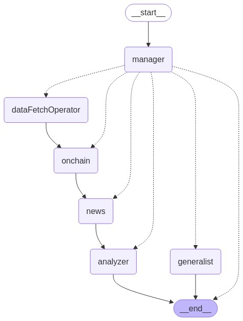

# daiko-ai-mvp-tgbot

This project demonstrates how to build a Telegram bot using [Solana Agent Kit](https://github.com/sendaifun/solana-agent-kit) and Cloudflare Workers.

## Graph Architecture



## 📌 Requirements

- [Node.js](https://nodejs.org/) (v18 or higher)
- [bun](https://bun.sh/) package manager
- [Cloudflare](https://www.cloudflare.com/) account
- [Telegram](https://telegram.org/) account and bot token
- [OpenAI API key](https://platform.openai.com/api-keys)

## 🍞 Quick Start

### 🔑 Getting a Telegram Bot Token

1. Connect to [@BotFather](https://t.me/BotFather) on Telegram
2. Send the `/newbot` command to create a new bot
3. Follow the instructions to set a name and username
4. Save the generated token (e.g., `123456789:ABCDefGhIJKlmNoPQRsTUVwxyZ`)

For more details, check [here](https://help.zoho.com/portal/en/kb/desk/support-channels/instant-messaging/telegram/articles/telegram-integration-with-zoho-desk#How_to_find_a_token_for_an_existing_Telegram_Bot).

### 🍞 Project Setup

1. Clone the repository

   ```bash
   git clone https://github.com/yourusername/sendai-cf-tgbot-sample.git
   ```

   ```bash
   cd sendai-cf-tgbot-sample
   ```

2. Install dependencies

   ```bash
   bun install
   ```

3. Set up environment variables

   - Copy `.dev.vars.example` to `.dev.vars`
   - Configure required variables (`TELEGRAM_BOT_TOKEN`, `OPENAI_API_KEY`, `SOLANA_PRIVATE_KEY`, etc.)

4. Start the local development server

   ```bash
   bun run dev
   ```

5. In a separate terminal, expose your local server using ngrok

   ```bash
   npx ngrok http 8787
   ```

6. Set up the webhook using the URL provided by ngrok

   ```bash
   curl https://api.telegram.org/bot<TELEGRAM_BOT_TOKEN>/setWebhook?url=https://<NGROK_URL>/
   ```

7. If successful, you'll see this response
   ```json
   { "ok": true, "result": true, "description": "Webhook was set" }
   ```

## Setup KV store

```bash
npx wrangler kv namespace create DAIKO_AI_DEV
```

## 🚀 Deploying to Cloudflare

1. Log in to Cloudflare and access Workers & Pages

2. Set environment variables as Cloudflare secrets

   ```bash
   npx wrangler secret put TELEGRAM_BOT_TOKEN
   npx wrangler secret put OPENAI_API_KEY
   # Set other required environment variables similarly
   ```

3. Deploy your project

   ```bash
   bun run deploy
   ```

4. Set up the webhook using your deployed URL
   ```bash
   curl https://api.telegram.org/bot<TELEGRAM_BOT_TOKEN>/setWebhook?url=https://<YOUR_WORKER_URL>/
   ```

## 🔧 Development

- `src/index.ts`: Main application code
- `wrangler.jsonc`: Cloudflare Workers configuration

### 🔍 Code Quality with Biome

This project uses [Biome](https://biomejs.dev/) for linting and formatting. Biome is a fast formatter and linter for JavaScript and TypeScript.

Available scripts:

- `bun lint`: Run Biome linter on source files
- `bun format`: Format source files with Biome
- `bun check`: Check and automatically fix issues in source files

VS Code users can install the [Biome extension](https://marketplace.visualstudio.com/items?itemName=biomejs.biome) for in-editor linting and formatting.

## 🤖 Troubleshooting

- **Webhook setup fails**: Verify that your URL is correct and your Telegram bot token is valid
- **Bot doesn't respond**: Check logs and ensure environment variables are properly configured
- When you run image generation tasks using an agent developed by Solana Agent Kit, sometimes it becomes a zombie process just keeping timeout and sending image generation tasks to API endlessly, so please be careful.

## 📝 License

MIT License

---

🎉 Congratulations! You now have a Telegram bot running with Solana Agent Kit on Cloudflare Workers.
