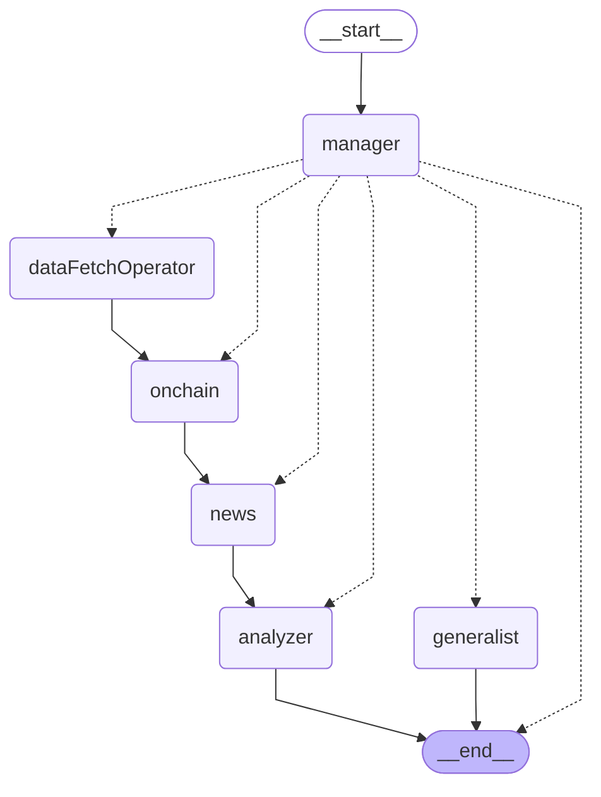

```mermaid
%%{init: {'flowchart': {'curve': 'linear'}}}%%
graph TD;
	__start__([<p>__start__</p>]):::first
	generalist(generalist)
	analyzer(analyzer)
	onchain(onchain)
	news(news)
	manager(manager)
	dataFetchOperator(dataFetchOperator)
	__end__([<p>__end__</p>]):::last
	__start__ --> manager;
	analyzer --> __end__;
	dataFetchOperator --> onchain;
	generalist --> __end__;
	news --> analyzer;
	onchain --> news;
	manager -.-> generalist;
	manager -.-> analyzer;
	manager -.-> onchain;
	manager -.-> news;
	manager -.-> dataFetchOperator;
	manager -.-> __end__;
	classDef default fill:#f2f0ff,line-height:1.2;
	classDef first fill-opacity:0;
	classDef last fill:#bfb6fc;

```